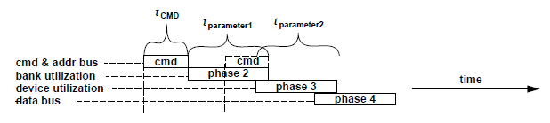
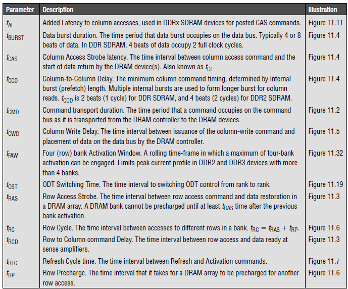
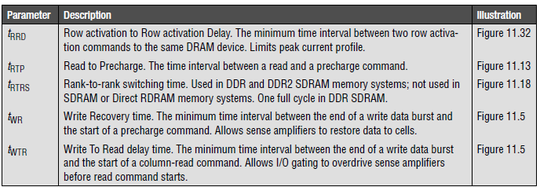
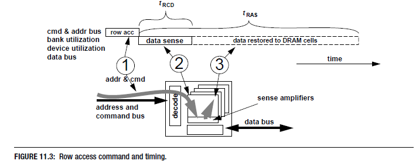
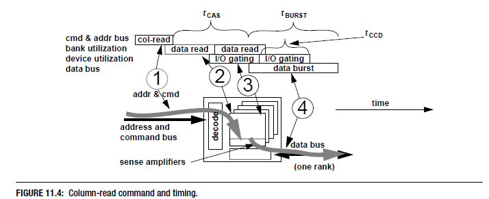

# Chapter 11 Summary

## Table of Contents

- [Chapter 11 Summary](#chapter-11-summary)
  - [Table of Contents](#table-of-contents)
  - [Basic DRAM Commands](#basic-dram-commands)
    - [1. Generic DRAM Command Format](#1-generic-dram-command-format)
    - [2. Timing Parameter Summary](#2-timing-parameter-summary)
    - [3. Row Access Command](#3-row-access-command)
    - [4. Column Read Command](#4-column-read-command)
    - [5. Column Write Command](#5-column-write-command)
    - [6. Precharge Command](#6-precharge-command)
    - [7. Refresh Command](#7-refresh-command)
    - [8. Read Cycle](#8-read-cycle)
    - [9. Write Cycle](#9-write-cycle)
    - [10. Compound Commands](#10-compound-commands)
  - [DRAM Command Interactions](#dram-command-interactions)
    - [1. Consecutive Reads and Writes to Same Rank](#1-consecutive-reads-and-writes-to-same-rank)
    - [2. Read to Precharge Timing](#2-read-to-precharge-timing)
    - [3. Consecutive Reads to Different Rows of Same Rank](#3-consecutive-reads-to-different-rows-of-same-rank)
      - [Best Scenario](#best-scenario)
      - [Worst Scenario](#worst-scenario)
    - [4. Consecutive Reads to Different Banks: Bank Conflict](#4-consecutive-reads-to-different-banks-bank-conflict)
      - [Without Command Reordering](#without-command-reordering)
      - [With Command Reordering](#with-command-reordering)
    - [5. Consecutive Read Requests to Different Ranks](#5-consecutive-read-requests-to-different-ranks)
    - [6. Consecutive Write Requests: Open Banks](#6-consecutive-write-requests-open-banks)
    - [7. Consecutive Write Requests: Bank Conflicts](#7-consecutive-write-requests-bank-conflicts)
    - [8. Write Request Following Read Request: Open Banks](#8-write-request-following-read-request-open-banks)
    - [9. Write Request Following Read Request to Different Banks, Bank Conflict, Best Case, No Reordering](#9-write-request-following-read-request-to-different-banks-bank-conflict-best-case-no-reordering)
    - [10. Read Following Write to Same Rank, Open Banks](#10-read-following-write-to-same-rank-open-banks)
    - [11. Write to Precharge Timing](#11-write-to-precharge-timing)
    - [12. Read Following Write to Different Ranks, Open Banks](#12-read-following-write-to-different-ranks-open-banks)
    - [13. Read Following Write to Same Bank, Bank Conflict](#13-read-following-write-to-same-bank-bank-conflict)
    - [14. Read Following Write to Different Banks of Same Rank, Bank Conflict, Best Case, No Reordering](#14-read-following-write-to-different-banks-of-same-rank-bank-conflict-best-case-no-reordering)
    - [15. Column-Read-and-Precharge Command Timing](#15-column-read-and-precharge-command-timing)
    - [16. Column-Write-and-Precharge Timing](#16-column-write-and-precharge-timing)
  - [Additional Constraints](#additional-constraints)
    - [1. Device Power Limit](#1-device-power-limit)
    - [2. tRRD: Row-to-Row (Activation) Delay](#2-trrd-row-to-row-activation-delay)
    - [3. tFAW: Four-Bank Activation Window](#3-tfaw-four-bank-activation-window)
    - [4. 2T Command Timing in Unbuffered Memory System](#4-2t-command-timing-in-unbuffered-memory-system)

## [Basic DRAM Commands](#table-of-contents)

### [1. Generic DRAM Command Format](#table-of-contents)

*t*CMD: DRAM Controller에서 보낸 CMD가 DRAM Device로 도착하는데 걸리는 시간이다.

*t*parameter1: 해당 CMD로 인해 특정 뱅크가 점유되는 시간. 각 뱅크마다 독립적으로 적용된다.

*t*parameter2: 해당 CMD로 인해 공유 자원이 점유되는 시간. 모든 뱅크가 공유하는 자원이기 때문에 각 뱅크가 공유하는 시간이다.

### [2. Timing Parameter Summary](#table-of-contents)

*t*AL: Column Access 시에 추가되는 Latency. Posted CAS 커맨드를 지원하는 DRAM Device에 대해 설정된 값에 기반하여 CAS 커맨드의의 동작을 지연시킨다.  

*t*BURST: Data Burst 시간. 데이터를 데이터 버스를 통해 전달하는 시간이다. 통상적으로 4 또는 8 beats를 전달하며, 4 beats는 clock cycle 2개를 차지한다 (rise 2번, fall 2번번).  

*t*CAS: Column Access Strobe Latency. Columnn Read 커맨드 입력 이후에 DRAM device로부터 요청한 데이터를 데이터 버스에 배치하기까지 걸리는 시간이다.  

*t*CCD: Column-to-Column Delay. 최소 버스트 기간 혹은 최소 column-to-column 커맨드 타이밍을 의미한다. DRAM device의 Prefetch 길이에 의해 결정된다. 만약 DDR SDRAM device의 Prefetch 길이가 2 beats라면 *t*CCD는 1 full-cycle이다.  

*t*CMD: Command Transport duration. 명령 버스(cmd & addr bus)가 점유되는 시간이다. 

*t*CWD: Column Write Delay. Column Write 커맨드가 버스로 입력된 시점부터 Write Data가 Data Bus에 위치하는데까지 걸리는 시간이다 (cmd -> data burst). 

*t*FAW: Four bank Activation Window. 동일한 DRAM 디바이스의 최대 네 개의 로우 활성화가 동시에 진행되는 경우의 구체적인 롤링 시간 구성의 정의. Row Activation은 적어도 RRD time만큼 떨어져 있어야 하며, 다섯 번째 Row Activation이 첫 번째 Row Activation이 시작된 시점으로부터 적어도 FAW time만큼 떨어져 있어야 한다. 이는 더 큰 DDR2 SDRAM 디바이스의 전류 소모량의 증가를 제한하기 위해서이다. 

*t*OST: ODT Switching Time. 랭크간 ODT(On-Die Termination) 제어 전환에 필요한 시간이다. 다른 랭크로의 연속적인 column write command에서 BURST time 사이에 추가되는 시간이다. 

*t*RAS: Row Access Strobe Latency. DRAM cell의 Row Data의 방출과 Refresh에 걸리는 시간을 의미한다. 

*t*RC: Row Cycle. RAS time + Row Precharge(RP) time.  

*t*RCD: Row to Column command delay. Row Access 커맨드 이후로, DRAM cell array의 데이터를 S/A로 옮기는 데 걸리는 시간이다. 

*t*RFC: Refresh Cycle Time. 모든 뱅크로 하나의 Refresh 커맨드를 전송하고 완료되기까지 걸리는 시간이다. 

*t*RP: Row Precharge. Precharge 커맨드 입력 이후에 선택된 뱅크의 Bit Line과 S/A가 Precharge되는데 걸리는 시간이다. 

*t*RRD: Row Activation to Row Activation Delay. 같은 device의 두 Row를 연속적으로 활성화할 때 기다려야하는 최소 시간이다. 이는 FAW time과 같이 전류 소모를 제한하기 위해 설정되었다. 

*t*RTP: Read to Precharge. 본질적으로 RTP time은은, 자체적으로 Column Read 커맨드와 Precharge 커맨드 사이에 필요한 최소시간을 의미한다. 그러나 일부 DRAM device에서는 약간 다르게 표현되기도 한다. 자세한 내용은 [11.2.2. Read to Precharge Timing](#2-read-to-precharge-timing) 참고  

*t*RTRS: Rank-to-rank switching time. DDR과 DDR2 SDRAM에서 사용되며, SDRAM이나 Direct RDRAM에서는 사용되지 않는다. 다른 랭크에 대한 연속적인 Read 커맨드에 대한 스위칭 시간이다. 

*t*WR: Write Recovery time. Write 데이터가 DRAM Array로 전파되는 데 걸리는 시간으로, Write 커맨드 직후 Precharge 커맨드를 전송하기 위해 대기해야하는 최소시간이다. 

*t*WTR: Write-to-Read Turnaround delay. I/O 게이팅 자원들이 Write 커맨드에 의하여 방출되는 데 걸리는 시간으로, Write 커맨드 직후 Read 커맨드를 전송하기 위해 대기해야 하는 최소시간이다.

### [3. Row Access Command](#table-of-contents)

관련된 time 요소: *t*RCD, *t*RAS

Row Access Command, 또는 Row Activation Command를 통해 DRAM Array에 있는 데이터를 S/A로 이동시키고, DRAM Array에 데이터를 Restore한다.
Command 입력 후 *t*RCD 이후에 활성화된 데이터의 모든 Row가 S/A와 연결된다. 그 후 Column Read나 Write를 통해 S/A와 메모리 컨트롤러간에 데이터를 주고 받는다. *t*RAS는 *t*RCD + 데이터 Restore 시간이다. *t*RAS 이후, S/A가 동일한 뱅크 내에 있는 다른 Row Access를 수행하기 위한 Precharge가 완료된다.

### [4. Column Read Command](#table-of-contents)

관련된 time 요소: *t*CAS, *t*BURST, *t*CCD

### [5. Column Write Command](#table-of-contents)

관련된 time 요소: *t*CWD, *t*BURST, *t*WTR, *t*WR

### [6. Precharge Command](#table-of-contents)

관련된 time 요소: *t*RAS, *t*RP, *t*RC

### [7. Refresh Command](#table-of-contents)

관련된 time 요소: *t*RAS, *t*RP, *t*RC, *t*RFC

### [8. Read Cycle](#table-of-contents)

관련된 time 요소: *t*RAS, *t*RP, *t*RC, *t*RCD, *t*CAS, *t*BURST

### [9. Write Cycle](#table-of-contents)

관련된 time 요소: *t*RAS, *t*RP, *t*RC, *t*RCD, *t*CWD, *t*BURST, *t*WR

### [10. Compound Commands](#table-of-contents)

관련된 time 요소: *t*RAS, *t*RP, *t*RC, *t*RCD, *t*CAS, *t*BURST, *t*AL

---------

## [DRAM Command Interactions](#table-of-contents)

### [1. Consecutive Reads and Writes to Same Rank](#table-of-contents)

관련된 time 요소: *t*BURST, *t*CCD, *t*CAS

### [2. Read to Precharge Timing](#table-of-contents)

관련된 time 요소: *t*BURST, *t*CCD, *t*RTP

### [3. Consecutive Reads to Different Rows of Same Rank](#table-of-contents)

관련된 time 요소: *t*BURST, *t*CCD, *t*RTP, *t*RP, *t*RCD, *t*CAS

#### [Best Scenario](#table-of-contents)

#### [Worst Scenario](#table-of-contents)

### [4. Consecutive Reads to Different Banks: Bank Conflict](#table-of-contents)

관련된 time 요소: *t*RP, *t*RCD, *t*CMD

#### [Without Command Reordering](#table-of-contents)

#### [With Command Reordering](#table-of-contents)

### [5. Consecutive Read Requests to Different Ranks](#table-of-contents)

관련된 time 요소: *t*BURST, *t*RTRS, *t*CAS

### [6. Consecutive Write Requests: Open Banks](#table-of-contents)

관련된 time 요소: *t*BURST, *t*OST, *t*CWD

### [7. Consecutive Write Requests: Bank Conflicts](#table-of-contents)

관련된 time 요소: *t*BURST, *t*WR, *t*CWD, *t*RP, *t*RCD, *t*CMD

### [8. Write Request Following Read Request: Open Banks](#table-of-contents)

관련된 time 요소: *t*BURST, *t*CAS, *t*RTRS, *t*CWD

### [9. Write Request Following Read Request to Different Banks, Bank Conflict, Best Case, No Reordering](#table-of-contents)

### [10. Read Following Write to Same Rank, Open Banks](#table-of-contents)

### [11. Write to Precharge Timing](#table-of-contents)

### [12. Read Following Write to Different Ranks, Open Banks](#table-of-contents)

### [13. Read Following Write to Same Bank, Bank Conflict](#table-of-contents)

### [14. Read Following Write to Different Banks of Same Rank, Bank Conflict, Best Case, No Reordering](#table-of-contents)

### [15. Column-Read-and-Precharge Command Timing](#table-of-contents)

### [16. Column-Write-and-Precharge Timing](#table-of-contents)

-------

## [Additional Constraints](#table-of-contents)

### [1. Device Power Limit](#table-of-contents)

### [2. tRRD: Row-to-Row (Activation) Delay](#table-of-contents)

### [3. tFAW: Four-Bank Activation Window](#table-of-contents)

### [4. 2T Command Timing in Unbuffered Memory System](#table-of-contents)
